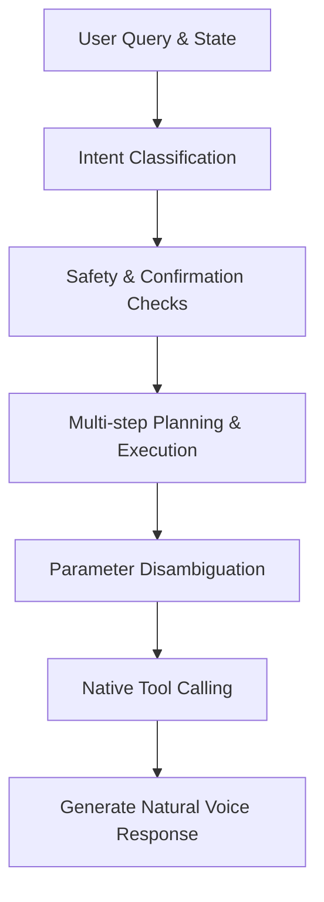

# Task 1 Architecture & Environmental Notes

This document captures the overall agent pipeline, architectural decisions, dataset taxonomy, and policy dependencies identified during Task 1.

## Agent Execution Flow Diagram
The agent under test processes requests in a sequential reasoning loop:

## Dataset & Intents (VinFast Vivi)
The VinFast Vivi dataset (`car-benchmark-vv`) categorizes user queries under 3 primary configurations:
1. **tasks_base**: Standard tasks requiring direct tool calls.
2. **tasks_disambiguation**: Ambiguous inputs requiring clarification prompts or user parameter options.
3. **tasks_hallucination**: Scenarios testing robustness against hallucinated parameters (e.g. missing required params or invalid tools).

A set of 25 Vivi specific intents have been defined in [intent_definitions.py](file:///e:/VinAI/car-bench-ijcai/src/track_1_agent_under_test/intent_definitions.py).

## Critical Safety & Confirmation Controls
According to `wiki.md`, specific rules require manual validation and/or user confirmations:
- **Confirmation Needed**: Any tools prefixed with `REQUIRES_CONFIRMATION` in their schema.
- **Sunroof Window Safety**: SUNROOF can only be opened if the SUNSHADE is fully opened or opened in parallel.
- **AC Interdependency**: If windows are opened more than 25% and AC is ON, prompt for confirmation and warn about energy inefficiency.
- **Weather Condition Checking**: Sunroof and Fog lights require confirmation if weather is unfavorable. Fog lights require Low beam headlights to be ON.
- **Defrosting Configuration**: defrosting activates fan speed 2, direction WINDSHIELD, and turns AC ON.
